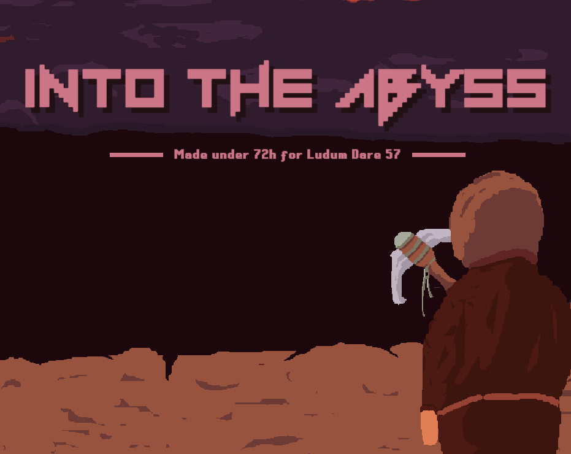
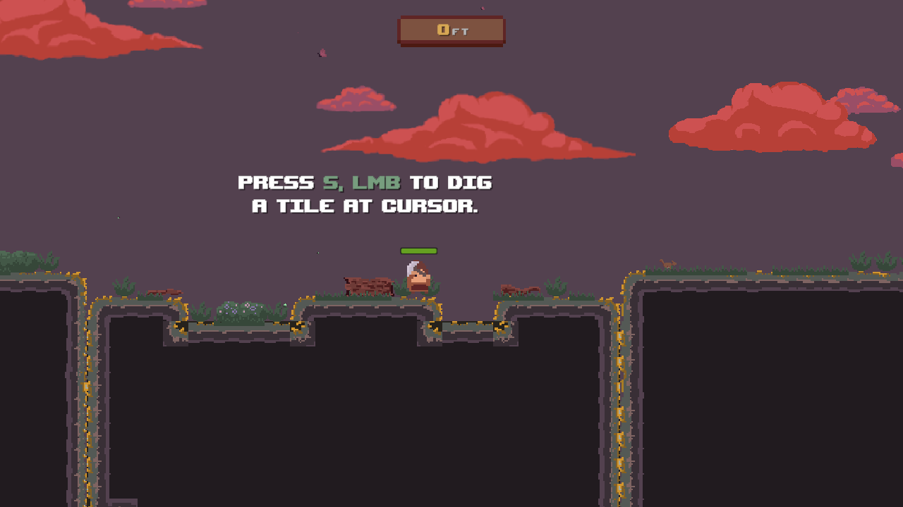
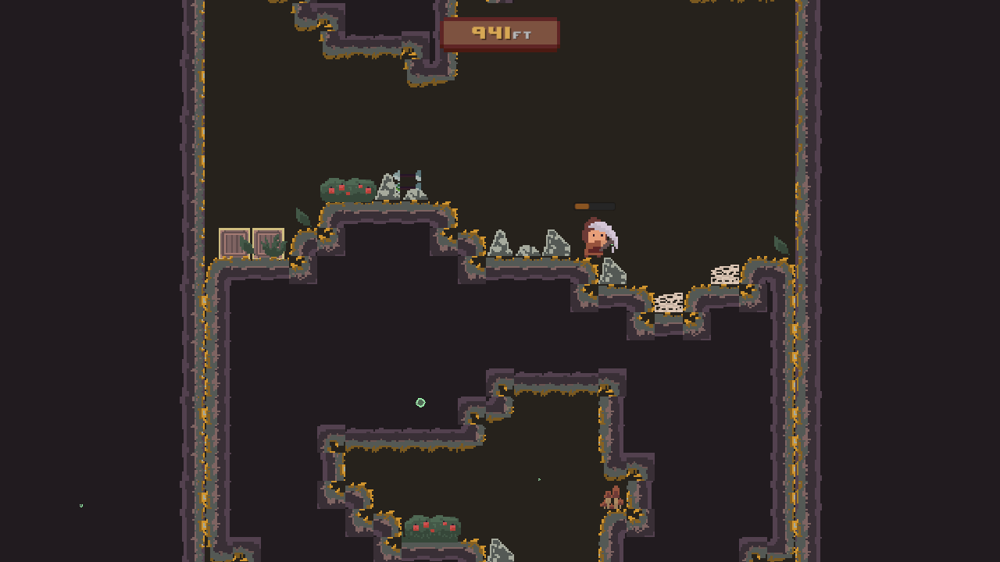
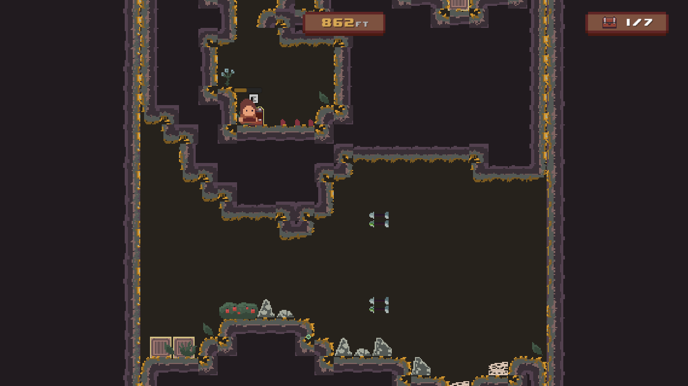
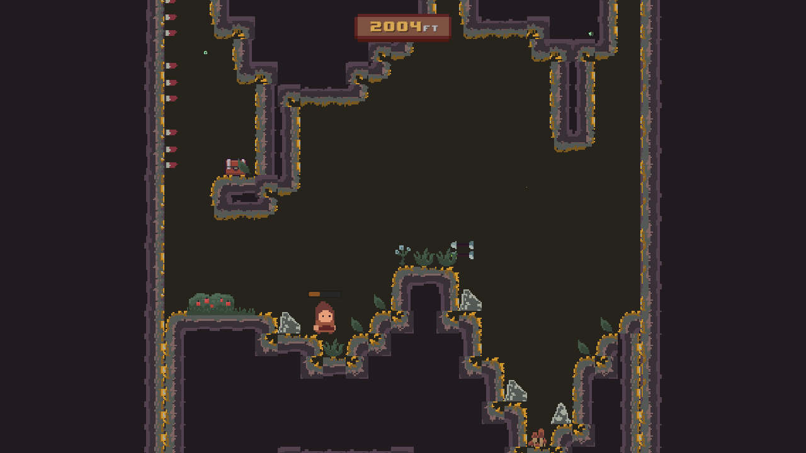

# INTO THE ABYSS

  

## OVERVIEW

A vertical platformer about digging, exploring, and repeat.

This game is an entry for [__Ludum Dare 57__](https://ldjam.com/events/ludum-dare/57), which starts on _April 5th, 2025_. It was made within 72 hours of the jam.

This `develop` branch is __PROTECTED__, it reflects the currently stable state of the game.

## DESCRIPTION

You’re an __archaeologist__. Alone, at the edge of a giant hole in the earth. Armed with nothing but your __trusty pickaxe__, you begin your descent into the unknown.

Into the Abyss is a __digging-focused__ platformer where exploration goes straight down. Your mission: __reach the bottom__, __uncover the truth__ behind the abyss, and do it as fast as you can, after all you can get a worth treasure. But be __careful__, watch out for those treacherous traps set by who knows anyway.

## CORE GAMEPLAY

___Dig Your Own Path:___ Break through dirt, stone, and ancient ruins with your pickaxe. You decide where to go—no set paths, no shortcuts.

___Find Hidden Treasures:___ Scattered along the descent are lost treasure chests filled with rare materials, secrets, and boosts. Getting them isn’t easy—but it’s worth it.

## TOOLS:

- Unity 6
- Visual Studio Code
- Aseprite
- Audacity

## LINKS

Check out the _jam submission_ page [__here__](https://ldjam.com/events/ludum-dare/57/into-the-abyss-2).

Play it _directly_ or download for your _current platform_ [__here__](https://constance012.itch.io/into-the-abyss).

## INGAME CAPTURES

_© 2024-2025 Hiyuka Studios, all rights reserved._